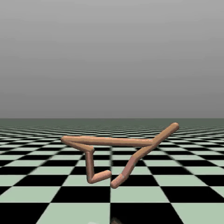
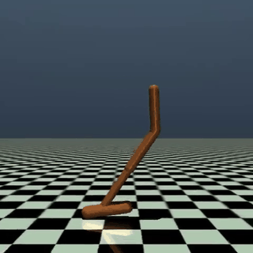
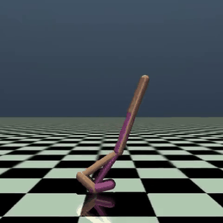

# Comparing Deep RL Algorithms for Continuous Locomotion Control in MuJoCo

CS 5180 — Reinforcement Learning and Sequential Decision Making
Ahmad Hassan | NUID: 002560629

**Algorithms:** TD3, SAC, PPO (all implemented from scratch in PyTorch)
**Environments:** HalfCheetah-v5, Hopper-v5, Walker2d-v5 (Gymnasium MuJoCo)

<p align="center">
  
  
  
</p>
<p align="center"><sub>SAC agents after 1 M training steps — HalfCheetah, Hopper, Walker2d</sub></p>

---

## Setup

```bash
pip install -r requirements.txt
```

Requires Python 3.9+ and a MuJoCo installation (handled automatically by `gymnasium[mujoco]`).

---

## Running Experiments

### 1. Random Baseline (run this first — fast)
```bash
python scripts/run_random_baseline.py
```

### 2. Main Experiments (3 algos × 3 envs × 5 seeds)
```bash
python scripts/run_main_experiments.py
```

Or run a single training job:
```bash
python scripts/train.py --algo td3 --env HalfCheetah-v5 --seed 0
python scripts/train.py --algo sac --env Hopper-v5 --seed 1
python scripts/train.py --algo ppo --env Walker2d-v5 --seed 2
```

### 3. Sensitivity Experiments
```bash
python scripts/run_sensitivity.py

# Just one sweep:
python scripts/run_sensitivity.py --sweep td3_noise

# One environment only:
python scripts/run_sensitivity.py --envs HalfCheetah-v5
```

### 4. Generate All Plots
```bash
python plotting/plot_all.py
```

Figures are saved to `results/figures/`.

### 5. Evaluate a Saved Model
```bash
python scripts/evaluate.py \
    --model results/main/td3/HalfCheetah-v5/seed_0/final_model.pt \
    --algo td3 --env HalfCheetah-v5

# With video recording (single model):
python scripts/evaluate.py \
    --model results/main/sac/Hopper-v5/seed_0/final_model.pt \
    --algo sac --env Hopper-v5 --record-video results/videos/
```

### 6. Record Agent Demo Videos (all 9 combinations)
```bash
python scripts/record_videos.py
```

Automatically selects the best seed per (algorithm, environment) pair by final
mean reward, records 10 deterministic episodes, and writes one concatenated MP4
per combination to `results/videos/`.

Output naming: `{algo}_{env_short}_best_seed{N}.mp4`

---

## Results Structure

```
results/
├── main/
│   ├── td3/
│   │   ├── HalfCheetah-v5/
│   │   │   └── seed_{0..4}/
│   │   │       ├── training_log.csv   # per-episode metrics
│   │   │       ├── eval_log.csv       # evaluation every 10k steps
│   │   │       ├── config.yaml        # exact hyperparameters used
│   │   │       └── final_model.pt     # saved weights
│   │   ├── Hopper-v5/ ...
│   │   └── Walker2d-v5/ ...
│   ├── sac/ ...
│   ├── ppo/ ...
│   └── random/                        # random policy baseline (eval_log.csv only)
├── sensitivity/
│   ├── td3_lr/
│   ├── td3_noise/
│   ├── sac_lr/
│   ├── sac_entropy/
│   └── ppo_clip/
├── figures/
│   ├── learning_curves_{env}.png      # mean ± std across 5 seeds
│   ├── sample_efficiency.png
│   ├── summary_table.png / .csv
│   └── sensitivity_*.png
└── videos/
    ├── td3_halfcheetah_best_seed2.mp4
    ├── td3_hopper_best_seed0.mp4
    ├── td3_walker2d_best_seed2.mp4
    ├── sac_halfcheetah_best_seed0.mp4
    ├── sac_hopper_best_seed4.mp4
    ├── sac_walker2d_best_seed0.mp4
    ├── ppo_halfcheetah_best_seed1.mp4
    ├── ppo_hopper_best_seed2.mp4
    └── ppo_walker2d_best_seed1.mp4
```

---

## Algorithm Implementations

All algorithms are implemented from scratch in PyTorch — no Stable-Baselines3.

| File | Algorithm | Key Ideas |
|---|---|---|
| `src/td3/td3.py` | TD3 | Twin Q-networks, delayed policy updates, target policy smoothing |
| `src/sac/sac.py` | SAC | Max-entropy objective, reparameterization trick, auto-tuned alpha |
| `src/ppo/ppo.py` | PPO | Clipped surrogate loss, GAE advantage estimation |

Shared components in `src/common/`:

| File | Purpose |
|---|---|
| `networks.py` | Actor/Critic MLP architectures for all three algorithms |
| `replay_buffer.py` | Off-policy uniform replay buffer |
| `rollout_buffer.py` | On-policy rollout buffer with GAE computation |
| `utils.py` | Seed setting, environment creation, policy evaluation |
| `logger.py` | CSV-based training and evaluation logging |

---

## Best Seeds Summary

| Algorithm | Environment | Best Seed | Final Mean Reward |
|---|---|---|---|
| TD3 | HalfCheetah-v5 | 2 | 10668.6 |
| TD3 | Hopper-v5 | 0 | 3322.8 |
| TD3 | Walker2d-v5 | 2 | 4711.5 |
| SAC | HalfCheetah-v5 | 0 | 11723.5 |
| SAC | Hopper-v5 | 4 | 3496.3 |
| SAC | Walker2d-v5 | 0 | 4884.5 |
| PPO | HalfCheetah-v5 | 1 | 1350.7 |
| PPO | Hopper-v5 | 2 | 3571.1 |
| PPO | Walker2d-v5 | 1 | 3369.0 |
